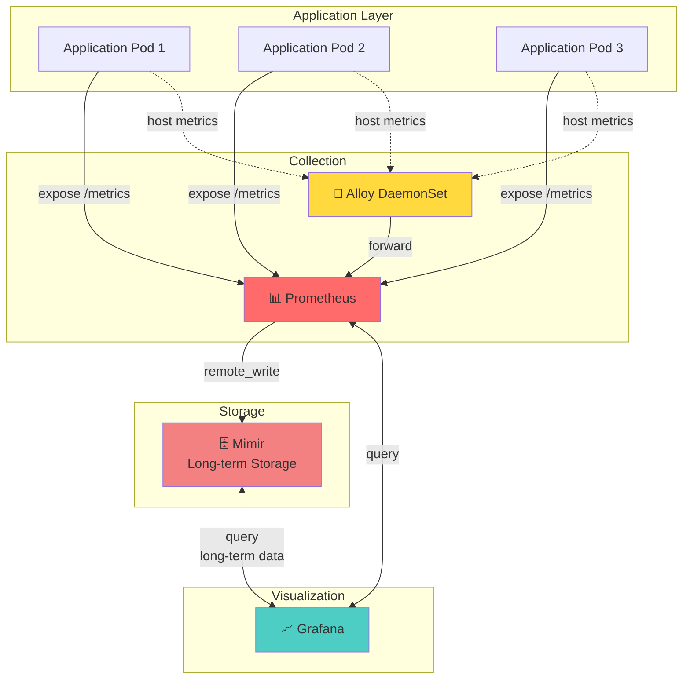
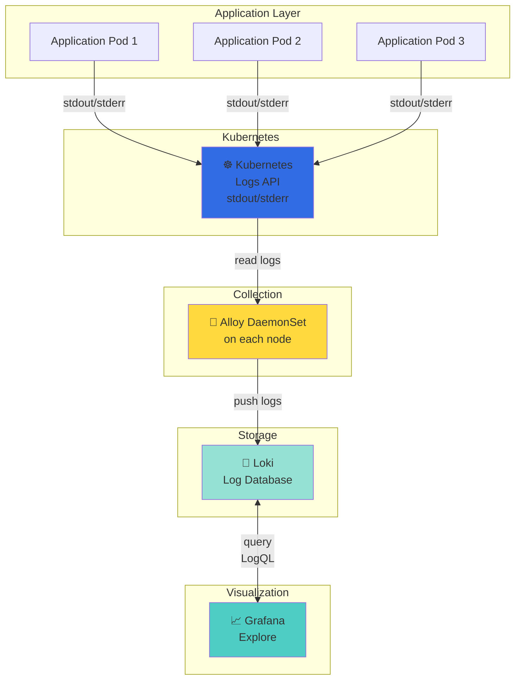
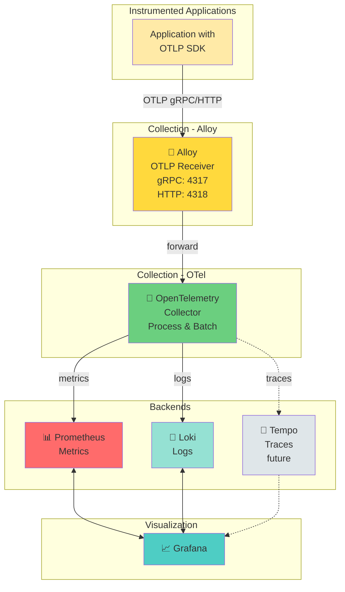
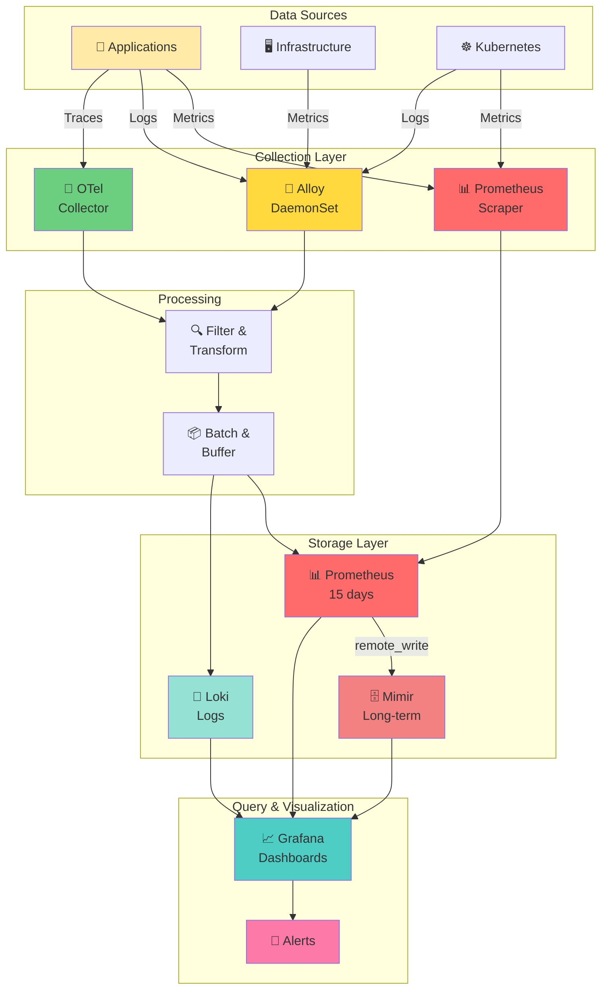
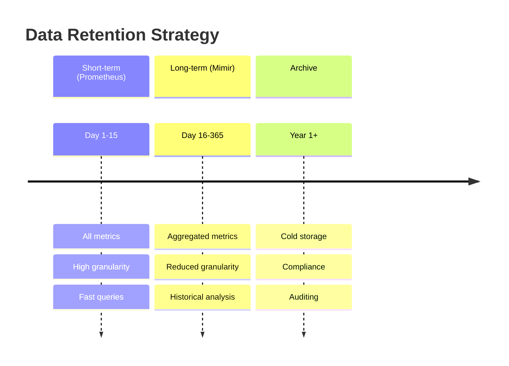
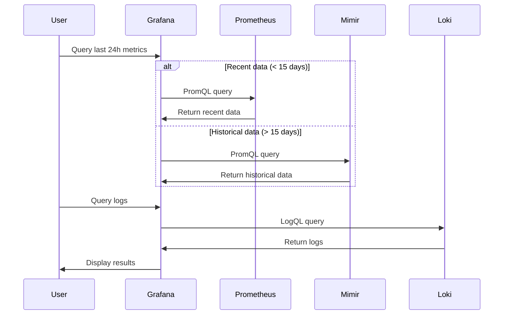
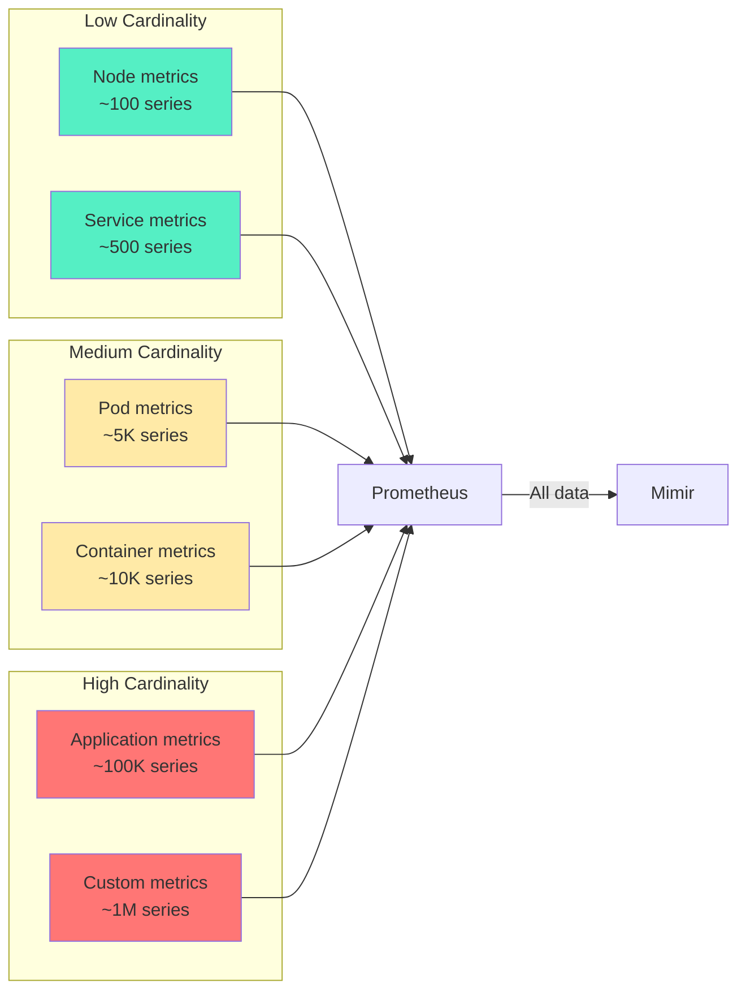

# Data Flow Diagrams

## Metrics Flow

## Logs Flow

## Traces Flow (OpenTelemetry)

## Complete Data Pipeline

## Data Retention Strategy

## Query Path

## Metrics Cardinality

## Legend

| Symbol | Component | Purpose |
|--------|-----------|---------|
| 📊 | Prometheus | Metrics collection & short-term storage |
| 🗄️ | Mimir | Long-term metrics storage |
| 📝 | Loki | Log aggregation & storage |
| 🔄 | Alloy | Collection agent (DaemonSet) |
| 🔭 | OpenTelemetry | Universal telemetry collector |
| 📈 | Grafana | Visualization & dashboards |
| ☸️ | Kubernetes | Container orchestration |
| 🚨 | Alerts | Alerting system |

## Data Flow Summary

1. **Metrics**: Apps → Prometheus → Mimir → Grafana
2. **Logs**: Apps → K8s → Alloy → Loki → Grafana
3. **Traces**: Apps → Alloy/OTel → (Future: Tempo) → Grafana
