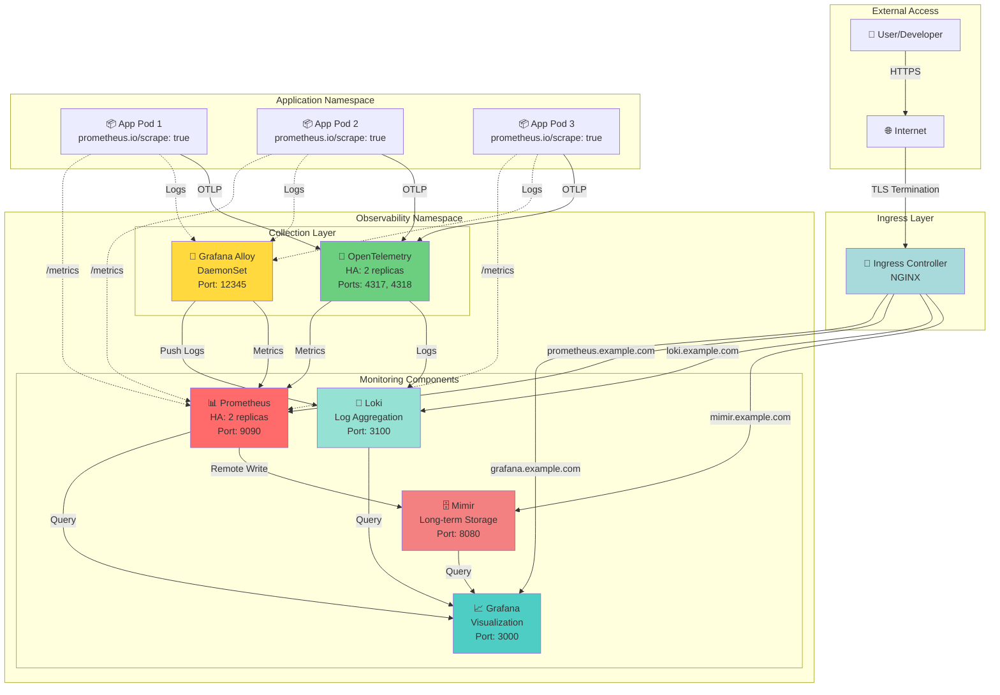
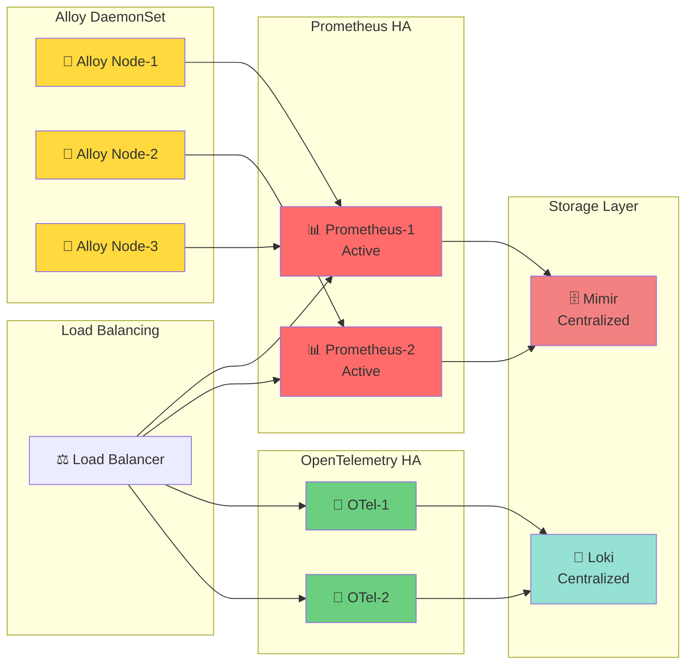
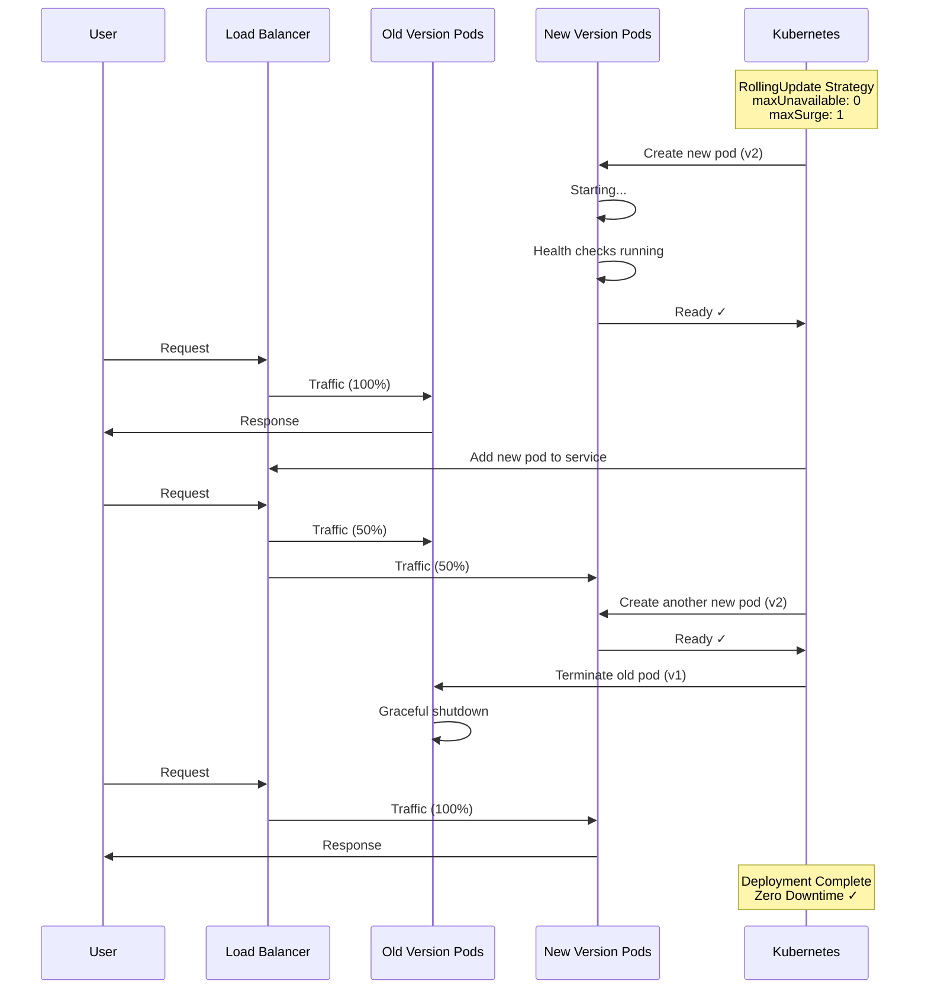

# System Architecture Diagram

## Overall Architecture

## High Availability Architecture

## Deployment Strategy - Zero Downtime

## Legend

- 📊 Prometheus - Metrics collection
- 📈 Grafana - Visualization
- 🗄️ Mimir - Long-term storage
- 📝 Loki - Log aggregation
- 🔄 Alloy - Collection agent
- 🔭 OpenTelemetry - Universal collector
- 🚪 Ingress - External access
- 📦 Application pods
- ⚖️ Load balancer

## Quick Reference

| Component | Port | Purpose |
|-----------|------|---------|
| Prometheus | 9090 | Metrics UI & API |
| Grafana | 3000 | Web UI |
| Loki | 3100 | Log API |
| Mimir | 8080 | Storage API |
| Alloy | 12345 | Agent metrics |
| OTel gRPC | 4317 | OTLP receiver |
| OTel HTTP | 4318 | OTLP receiver |
| OTel Health | 13133 | Health checks |
